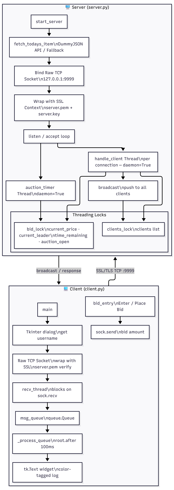
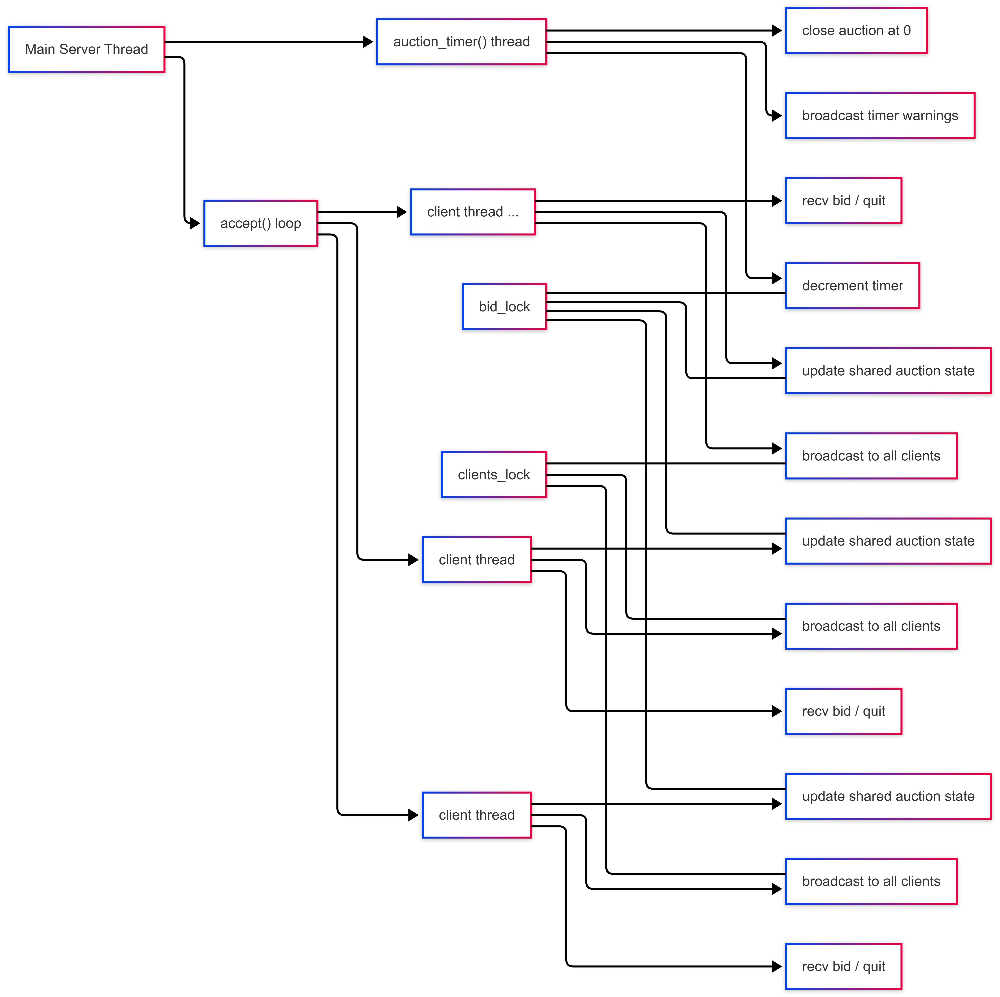
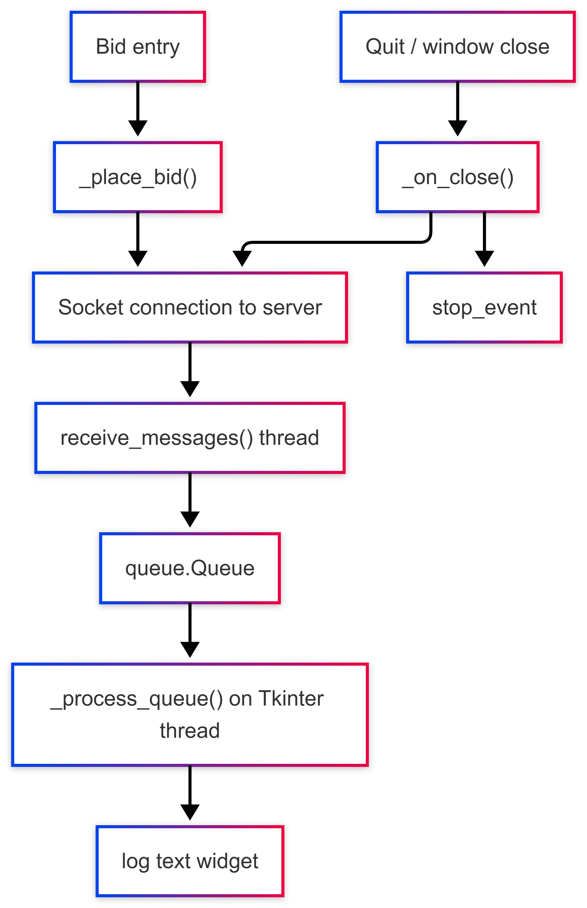

# Online Auction Engine

This is a Python socket programming mini project for a simple online auction system. Clients connect over TCP, place bids from a Tkinter GUI, and receive live updates from the server. SSL/TLS is used to secure the connection.

> **Built for:** PES University - Semester 4, Section A CSE, 2025-26 (2028 batch), Computer Networks Mini-Project

> Built By:
> 
> PES2UG24CS:
> 
> Abhigyan Dutta (019)
> 
> Aakash Agarwal (009)
> 
> Aditya Gyaneshwar Mule (031)

---

## Architecture



---

## Main Features

- TCP client-server communication using Python sockets
- SSL/TLS support with a self-signed certificate
- Multi-client handling using threads
- Live bid broadcasts and anti-sniping timer reset
- Tkinter GUI client with a background receive thread
- Item fetch from DummyJSON with fallback items
- Basic bid validation and clean shutdown handling

---

## Project Structure
```text
Online-Auction-Engine/
├── server.py
├── client.py
├── perf_eval.py
├── server.pem
├── images/
│   ├── architecture.png
│   ├── concurrency.png
│   └── gui_client_diagram.png
├── .gitignore
└── README.md
```

---

## Installation

### Prerequisites

- **Python 3.10+** (includes `tkinter` on Windows by default)
- **OpenSSL** (for certificate generation)
- No external packages required - uses only the Python standard library

### Clone & Run
```bash
git clone https://github.com/UltraBot05/Online-Auction-Engine.git
cd Online-Auction-Engine
```

### Generate SSL Certificate (first time only)
```bash
openssl req -x509 -newkey rsa:2048 -keyout server.key -out server.pem -days 365 -nodes -subj "/CN=AuctionServer"
```

This generates `server.key` (keep private, never commit) and `server.pem` (already in repo).

---

## How to Use

### 1. Start the Server
```bash
python server.py
```

The server will:
1. Fetch a random item from the API or fallback list.
2. Bind to `0.0.0.0:9999` and start listening.
3. Start the auction countdown.
4. Print a reminder showing how clients can connect if an ngrok TCP tunnel is being used.

### 2. Connect One or More Clients

Open a new terminal for each bidder:
```bash
python client.py
```

For local testing, use:

```bash
python client.py 127.0.0.1 9999
```

For cross-device testing through ngrok TCP, use the host and port shown by the ngrok tunnel:

```bash
python client.py <host-from-ngrok> <port-from-ngrok>
```

Each client will:
1. Prompt for the **server IPv4 / hostname** if it was not passed on the command line.
2. Prompt for a **bidder name** via a Tkinter dialog.
3. Connect to the server over SSL-secured TCP.
4. Open a GUI window showing the live auction log and a bid entry bar.

### 3. Place Bids

- Type a whole-number bid in the entry box and press **Enter** or click **Place Bid**.
- The bid must be at least **$5 higher** than the current price.
- All connected clients see new bids, timer warnings, and results in real time.

### 4. Auction Ends

When the timer reaches zero, the server broadcasts the **winner** and **final price** to every client. No further bids are accepted.

---

## Implementation Notes

### Networking Architecture

The project uses Python's `socket` module directly. The server binds, listens, and accepts
connections in a loop, while each accepted client gets a separate socket. TCP was chosen
because ordered and reliable delivery matters for auction state updates.

### SSL/TLS Security

The server uses `PROTOCOL_TLS_SERVER` with `server.pem` and `server.key`. The client uses
`PROTOCOL_TLS_CLIENT`, trusts `server.pem`, and disables hostname checking for the classroom
self-signed setup. The certificate is generated once on the server machine, and only the
public certificate file (`server.pem`) needs to be shared with clients.

### Concurrency



Two locks are used: `bid_lock` protects the auction state, and `clients_lock` protects the
shared client list. Client threads and the timer thread are daemon threads.

### Anti-Sniping Protection

- A shared `time_remaining` variable is decremented each second by the timer thread.
- When a valid bid is accepted inside `bid_lock`, `time_remaining` is **reset to exactly 20 seconds**.
- This gives all bidders a fair window to respond to any last-moment bid.

### API Item Fetch

At startup, `fetch_todays_item()` randomly selects one of four DummyJSON category endpoints:

| Category | Endpoint |
|---|---|
| Smartphones | `https://dummyjson.com/products/category/smartphones` |
| Laptops | `https://dummyjson.com/products/category/laptops` |
| Tablets | `https://dummyjson.com/products/category/tablets` |
| Men's Shoes | `https://dummyjson.com/products/category/mens-shoes` |

If the API call fails, the server picks a random item from a local fallback list.

### GUI Client



`recv_thread` reads from the socket and pushes messages into a `queue.Queue`. `_process_queue()`
updates the GUI on the Tkinter thread, and `stop_event` is used during shutdown.

### Bid Validation Rules

1. **Integer-only:** Any input containing `.` or failing `int()` parsing is rejected.
2. **Minimum increment:** A bid must be **≥ current_price + $5** to be accepted.
3. **Auction-closed guard:** If the timer has expired, all bids return `[CLOSED]`.

## Performance Evaluation

Performance was checked locally using `perf_eval.py`, which uses the same socket and TLS setup as the main application.

| Setting / Metric | Value |
|---|---|
| Test environment | `Localhost TLS test on Windows` |
| Host / Port | `127.0.0.1:9999` |
| Auction duration | `300 s` |
| Latency samples | `10` |
| Concurrent clients | `10` |
| Bids per client | `5` |
| Min / Max / Avg connection latency | `3.75 / 31.02 / 13.46 ms` |
| Connection latency std dev | `9.56 ms` |
| Min / Max / Avg bid RTT | `0.02 / 0.56 / 0.12 ms` |
| Median bid RTT | `0.09 ms` |
| Bid RTT std dev | `0.11 ms` |
| Total bids / Total time | `50 bids / 0.54 s` |
| Throughput | `92.0 bids/sec` |
| Errors | `0` |

### Observations

- Connection latency stayed low overall during repeated TLS connections on localhost.
- The server handled 10 concurrent clients and 50 total bid submissions in a short burst.
- Bid processing throughput was high enough for a classroom-scale auction workload.
- During the stress test, some clients closed immediately after finishing their actions, but the server remained running and completed the auction correctly.

### Testing Constraint

Benchmark values in this README were collected on localhost so that latency and throughput
could be measured without outside network interference. During cross-device testing, direct
LAN or hotspot connections were unreliable on some restrictive networks, likely because of
client isolation or firewall policy. Cross-device connectivity was later tested successfully
using an ngrok TCP tunnel, which allowed remote clients to connect to the same auction server
over the internet while keeping the socket/TLS logic unchanged.

---

## Debugging and Fixes

- The server was updated to survive bad or incomplete TLS handshakes instead of terminating.
- The client no longer shows false disconnects during quiet periods after connection setup.
- Abrupt client closes are handled more safely during stress testing.
- Invalid bid formats are rejected cleanly.
- Direct cross-device testing on some hotspot or captive-portal networks suggested peer-to-peer reachability issues even though the local TCP/TLS setup was working.
- Cross-device testing was later made possible through an ngrok TCP tunnel, which confirmed that the application could work across physical devices when network restrictions were bypassed.
- A late-join connection issue was observed during one ngrok-based test and was traced to the connection path rather than the auction timer logic; the server accept loop itself continues to run throughout the auction.

---

## Configuration

All tunable constants are at the top of `server.py`:

| Constant | Default | Purpose |
|---|---|---|
| `AUCTION_DURATION` | `300` | Total auction length in seconds |
| `RESET_SECONDS` | `20` | Anti-sniping clock reset value |
| `HOST` | `0.0.0.0` | Server bind address (listen on all interfaces) |
| `PORT` | `9999` | Server TCP port |

---

## License

MIT
