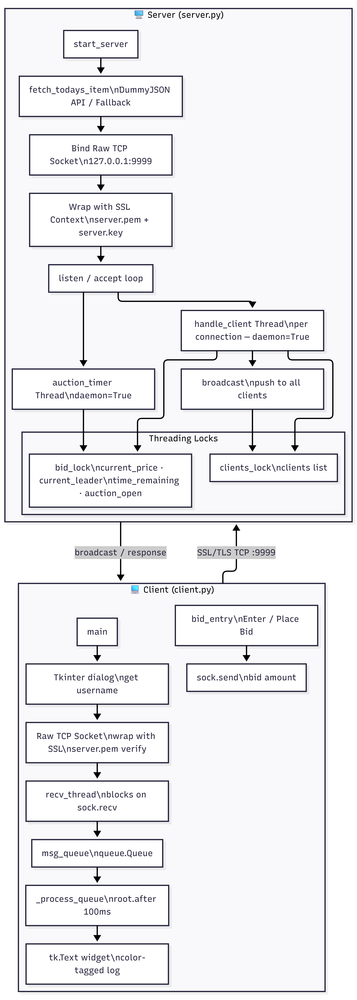

# Online Auction Engine - Real-Time Bidding System

A concurrent, network-based auction engine built with Python's `socket` and `threading` libraries. Multiple clients connect over **TCP**, place bids through a **Tkinter GUI**, and receive live broadcasts - all coordinated by a multi-threaded server with anti-sniping protection and dynamic item loading from a REST API. All communication is secured with **SSL/TLS**.

> **Built for:** PES University - Semester 4, Computer Networks Mini-Project

---

## Architecture



---

## Features

| Feature | Description |
|---|---|
| **TCP Client-Server** | Reliable, ordered delivery via `AF_INET` + `SOCK_STREAM` sockets |
| **SSL/TLS Encryption** | All communication secured using Python's `ssl` module with a self-signed certificate |
| **Multi-Client Concurrency** | Each bidder handled in a dedicated `threading.Thread` |
| **Real-Time Broadcasting** | New bids, join/leave events, and timer warnings pushed to all clients instantly |
| **Anti-Sniping Timer** | Any bid in the final seconds resets the countdown to 20 s |
| **Live API Items** | Auction item fetched at startup from DummyJSON (laptops, smartphones, tablets, shoes) |
| **Robust Fallback** | If the API is unreachable, a curated fallback list is used automatically |
| **Integer-Only Bids** | Decimal bids are rejected; minimum increment of **$5** enforced |
| **Tkinter GUI Client** | Threaded receive via `queue.Queue` keeps the UI responsive during broadcasts |
| **Color-Coded Logs** | ANSI-colored server terminal + Tkinter-tagged client messages |

---

## Project Structure
```
Online-Auction-Engine/
├── server.py           # Multi-threaded TCP auction server with SSL/TLS
├── client.py           # Tkinter GUI bidding client with SSL/TLS
├── server.pem          # SSL certificate (self-signed, shared with clients)
├── architecture.png    # System architecture diagram
├── .gitignore
└── README.md
```

---

## Installation

### Prerequisites

- **Python 3.10+** (includes `tkinter` on Windows by default)
- **OpenSSL** (for certificate generation)
- No external packages required - uses only the Python standard library

### Clone & Run
```bash
git clone https://github.com/UltraBot05/Online-Auction-Engine.git
cd Online-Auction-Engine
```

### Generate SSL Certificate (first time only)
```bash
openssl req -x509 -newkey rsa:2048 -keyout server.key -out server.pem -days 365 -nodes -subj "/CN=localhost"
```

This generates `server.key` (keep private, never commit) and `server.pem` (already in repo).

---

## How to Use

### 1. Start the Server
```bash
python server.py
```

The server will:
1. Fetch a random product from the DummyJSON API (or use a fallback item).
2. Bind to `127.0.0.1:9999`, wrap the socket with SSL/TLS, and begin a **60-second** auction countdown.
3. Print color-coded logs to the terminal.

### 2. Connect One or More Clients

Open a new terminal for each bidder:
```bash
python client.py
```

Each client will:
1. Prompt for a **bidder name** via a Tkinter dialog.
2. Connect to the server over SSL-secured TCP.
3. Open a GUI window showing the live auction log and a bid entry bar.

### 3. Place Bids

- Type a whole-number bid in the entry box and press **Enter** or click **Place Bid**.
- The bid must be at least **$5 higher** than the current price.
- All connected clients see new bids, timer warnings, and results in real time.

### 4. Auction Ends

When the timer reaches zero, the server broadcasts the **winner** and **final price** to every client. No further bids are accepted.

---

## Technical Highlights

### Networking Architecture

The system uses the **TCP/IP** protocol stack via Python's `socket` module:

- **Server Socket:** `socket.socket(AF_INET, SOCK_STREAM)` - binds to a port, listens for incoming connections, and calls `.accept()` in a loop.
- **Per-Client Socket:** Each `.accept()` returns a dedicated socket for that bidder, enabling full-duplex communication.
- **Protocol Choice:** TCP (`SOCK_STREAM`) guarantees reliable, ordered delivery - critical for an auction where lost or reordered bid packets would corrupt state.

### SSL/TLS Security

All communication is encrypted using Python's built-in `ssl` module:

- **Server:** Creates an `SSLContext` with `PROTOCOL_TLS_SERVER`, loads `server.pem` and `server.key`, and wraps the raw socket before accepting connections.
- **Client:** Creates an `SSLContext` with `PROTOCOL_TLS_CLIENT`, loads `server.pem` to verify the server's identity, and wraps the socket with `server_hostname="localhost"`.
- **Certificate:** Self-signed certificate generated with OpenSSL (`CN=localhost`). The private key (`server.key`) is gitignored and must be generated locally.

### Concurrency Model
```
Main Thread                 Per-Client Threads           Timer Thread
───────────                 ──────────────────           ────────────
server_socket.listen()
       │
  .accept() ──► Thread-1 → handle_client(connA)     auction_timer()
       │                                                    │
  .accept() ──► Thread-2 → handle_client(connB)      time.sleep(1)
       │                                              decrement clock
      ...                                             broadcast warnings
```

- **`threading.Lock` (bid_lock):** Guards `current_price`, `current_leader`, `auction_open`, and `time_remaining`.
- **`threading.Lock` (clients_lock):** Guards the shared `clients[]` broadcast list.
- **Daemon Threads:** All client and timer threads are marked `daemon=True` so they terminate automatically when the main process exits.

### Anti-Sniping Protection

- A shared `time_remaining` variable is decremented each second by the timer thread.
- When a valid bid is accepted inside `bid_lock`, `time_remaining` is **reset to exactly 20 seconds**.
- This gives all bidders a fair window to respond to any last-moment bid.

### Dynamic API Integration

At startup, `fetch_todays_item()` randomly selects one of four DummyJSON category endpoints:

| Category | Endpoint |
|---|---|
| Smartphones | `https://dummyjson.com/products/category/smartphones` |
| Laptops | `https://dummyjson.com/products/category/laptops` |
| Tablets | `https://dummyjson.com/products/category/tablets` |
| Men's Shoes | `https://dummyjson.com/products/category/mens-shoes` |

**Fallback:** If the API call fails, a random item is selected from a hardcoded list.

### Multi-Threaded GUI Client
```
Background Thread               Queue                GUI Thread
─────────────────               ─────                ──────────
recv_thread                                          root.mainloop()
  sock.recv() ──► msg_queue.put()                         │
  (blocks on network)           ◄── msg_queue.get() ◄─ root.after(100ms)
                                                          │
                                                     Text.insert(tag)
```

- **`recv_thread`:** Loops `socket.recv()`, never touches Tkinter widgets, pushes messages into a `queue.Queue`.
- **`_process_queue()`:** Scheduled every 100 ms via `root.after()`. Drains the queue and inserts messages with color tags on the GUI thread.
- **`threading.Event` (stop_event):** Shared flag between threads for clean shutdown.

### Bid Validation Rules

1. **Integer-only:** Any input containing `.` or failing `int()` parsing is rejected.
2. **Minimum increment:** A bid must be **≥ current_price + $5** to be accepted.
3. **Auction-closed guard:** If the timer has expired, all bids return `[CLOSED]`.

---

## Configuration

All tunable constants are at the top of `server.py`:

| Constant | Default | Purpose |
|---|---|---|
| `AUCTION_DURATION` | `60` | Total auction length in seconds |
| `RESET_SECONDS` | `20` | Anti-sniping clock reset value |
| `HOST` | `127.0.0.1` | Server bind address |
| `PORT` | `9999` | Server TCP port |

---

## License

MIT